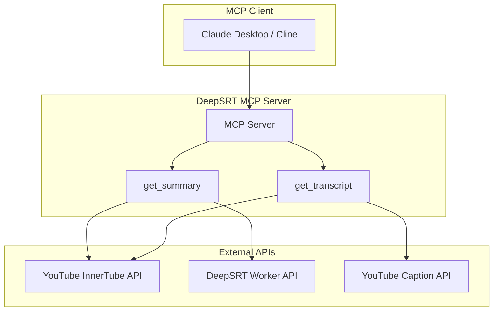
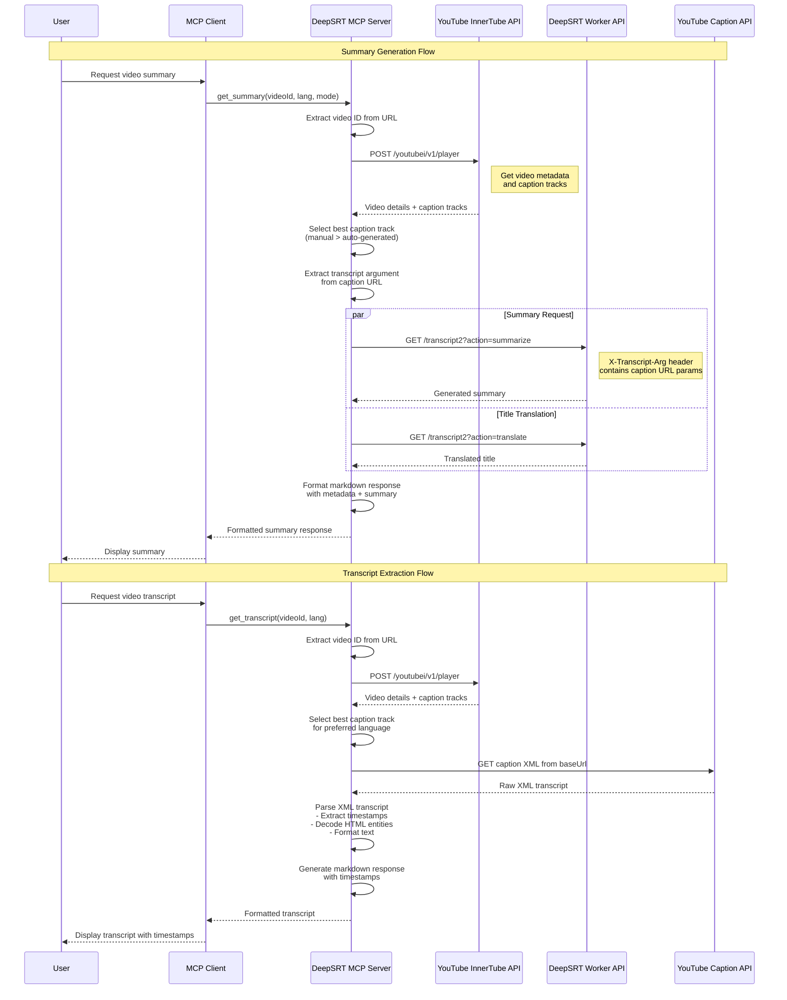
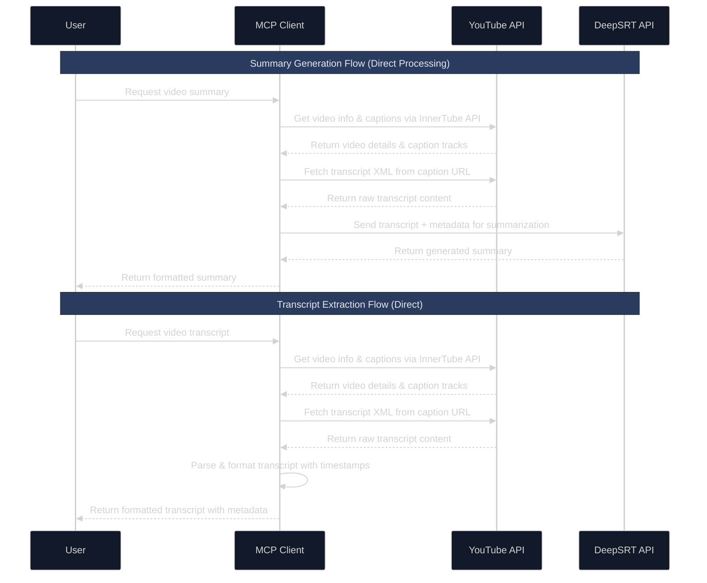

# DeepSRT MCP Server

A Model Context Protocol (MCP) server that provides YouTube video summarization and transcript extraction functionality through integration with DeepSRT's API and direct YouTube caption access.

## Architecture



## Sequence Flow



## Technical Architecture

### Core Components

#### 1. **MCP Server Layer**
- **Runtime Support**: Both Node.js and Bun execution
- **Protocol Handling**: Model Context Protocol (MCP) request/response management
- **Tool Registration**: `get_summary` and `get_transcript` tools
- **Error Handling**: Comprehensive error management with user-friendly messages

#### 2. **Video Processing Pipeline**
- **URL Parser**: Supports multiple YouTube URL formats and direct video IDs
- **InnerTube Integration**: Direct YouTube API access without API keys
- **Caption Discovery**: Automatic detection of available caption tracks
- **Quality Selection**: Prioritizes manual captions over auto-generated ones

#### 3. **Transcript Processing**
- **XML Parser**: Handles YouTube's `<timedtext>` format
- **Entity Decoder**: Converts HTML entities to readable text
- **Timestamp Formatter**: Converts milliseconds to `[MM:SS]` format
- **Content Filter**: Removes music notation and empty segments

#### 4. **Summary Generation**
- **DeepSRT Integration**: Direct API calls to `worker.deepsrt.com`
- **Multi-language Support**: Supports zh-tw, en, ja, and other languages
- **Mode Selection**: Narrative and bullet-point summary formats
- **Title Translation**: Automatic title translation to target language

### Key Features

#### **No Pre-caching Required**
- Works immediately for any YouTube video with captions
- Real-time transcript extraction and processing
- No dependency on external caching systems

#### **Intelligent Caption Selection**
- **Priority Order**: Manual > Auto-generated > Any available
- **Language Preference**: Respects user's preferred language
- **Fallback Strategy**: Graceful degradation to available options

#### **Robust Error Handling**
- Network timeout management (30-second timeout)
- API error translation to user-friendly messages
- Graceful handling of videos without captions
- Comprehensive validation of input parameters

#### **Multi-format Output**
- **Markdown Formatting**: Rich text with headers and metadata
- **Structured Data**: Video information, duration, author details
- **Timestamped Transcripts**: Precise timing information
- **Localized Summaries**: Content in user's preferred language

### Performance Characteristics

- **Fast Startup**: < 1 second server initialization
- **Efficient Processing**: Parallel API calls for summary + title translation
- **Memory Efficient**: Streaming XML parsing, no large data buffering
- **Network Optimized**: Single request per video for metadata + captions

## Features

- Generate summaries for YouTube videos
- Extract full transcripts with timestamps from YouTube videos
- Support for both narrative and bullet-point summary modes
- Multi-language support (default: zh-tw)
- Direct YouTube caption access (no API key required)
- Seamless integration with MCP-enabled environments

## How it Works

### Summary Generation

1. **Direct YouTube Integration**
   - Extracts video information and captions directly from YouTube using the InnerTube API
   - Fetches transcript content from YouTube's caption system
   - Sends transcript data to DeepSRT API for summarization

2. **Real-time Processing**
   - No pre-caching required - works immediately for any video with captions
   - Automatically selects the best available captions (manual preferred over auto-generated)
   - Supports multiple languages and summary modes

### Transcript Extraction

1. **Direct YouTube Access**
   - Transcripts are extracted directly from YouTube's caption system using the InnerTube API
   - No pre-caching required - works immediately for any video with captions

2. **Caption Selection**
   - Automatically selects the best available captions (manual captions preferred over auto-generated)
   - Supports language preference selection
   - Falls back gracefully to available alternatives

3. **Timestamp Formatting**
   - Provides clean, formatted transcripts with timestamps in [MM:SS] format
   - Handles both manual and auto-generated captions
   - Includes video metadata and caption information



## CLI Usage

The DeepSRT MCP server also provides a convenient CLI interface for direct usage without requiring an MCP client.

### Direct CLI Commands

```bash
# Extract transcript with timestamps
npx @deepsrt/deepsrt-mcp get-transcript https://www.youtube.com/watch?v=dQw4w9WgXcQ
npx @deepsrt/deepsrt-mcp get-transcript dQw4w9WgXcQ --lang en

# Generate video summary
npx @deepsrt/deepsrt-mcp get-summary dQw4w9WgXcQ --lang zh-tw --mode bullet
npx @deepsrt/deepsrt-mcp get-summary https://youtu.be/dQw4w9WgXcQ --lang ja

# Using bunx (alternative)
bunx @deepsrt/deepsrt-mcp get-transcript https://www.youtube.com/watch?v=dQw4w9WgXcQ
bunx @deepsrt/deepsrt-mcp get-summary dQw4w9WgXcQ --lang zh-tw --mode bullet
```

### Global Installation

For easier access, install globally:

```bash
# Install globally
npm install -g @deepsrt/deepsrt-mcp

# Then use directly
deepsrt get-transcript https://youtu.be/dQw4w9WgXcQ --lang en
deepsrt get-summary dQw4w9WgXcQ --lang zh-tw --mode narrative
```

### CLI Options

#### get-transcript
```bash
deepsrt get-transcript <video-url> [options]

Options:
  --lang=<language>    Preferred language code for captions (default: en)
                      Examples: en, zh-tw, ja, es, fr

Examples:
  deepsrt get-transcript https://www.youtube.com/watch?v=dQw4w9WgXcQ
  deepsrt get-transcript dQw4w9WgXcQ --lang=zh-tw
  deepsrt get-transcript https://youtu.be/dQw4w9WgXcQ --lang=ja
```

#### get-summary
```bash
deepsrt get-summary <video-url> [options]

Options:
  --lang=<language>    Target language for summary (default: zh-tw)
                      Examples: zh-tw, en, ja, es, fr
  --mode=<mode>        Summary format (default: narrative)
                      Options: narrative, bullet

Examples:
  deepsrt get-summary https://www.youtube.com/watch?v=dQw4w9WgXcQ
  deepsrt get-summary dQw4w9WgXcQ --lang=en --mode=bullet
  deepsrt get-summary https://youtu.be/dQw4w9WgXcQ --lang=ja --mode=narrative
```

### Supported URL Formats

The CLI accepts multiple YouTube URL formats:

```bash
# Full YouTube URLs
https://www.youtube.com/watch?v=dQw4w9WgXcQ
https://www.youtube.com/watch?v=dQw4w9WgXcQ&t=30s

# Short URLs
https://youtu.be/dQw4w9WgXcQ

# Embed URLs
https://www.youtube.com/embed/dQw4w9WgXcQ

# Direct video IDs
dQw4w9WgXcQ
```

### CLI Features

- **Direct execution**: No MCP client required
- **Multiple URL formats**: Full URLs, short URLs, or direct video IDs
- **Language support**: Specify target language for summaries and transcript preferences
- **Summary modes**: Choose between narrative or bullet-point formats
- **Rich output**: Colored console output with progress indicators
- **Error handling**: Clear error messages with suggestions

### Example Output

#### Transcript Output
```
# Rick Astley - Never Gonna Give You Up (Official Video) (4K Remaster)

**Author:** Rick Astley  
**Duration:** 3:33  
**Captions:** English (manual)

## Transcript

[00:18] ♪ We're no strangers to love ♪
[00:22] ♪ You know the rules and so do I ♪
[00:27] ♪ A full commitment's what I'm thinking of ♪
...
```

#### Summary Output
```
# 瑞克·艾斯利 - 永遠不會放棄你

**Author:** Rick Astley  
**Duration:** 3:33  
**Language:** zh-tw  
**Mode:** narrative

## Summary

這是一首經典的流行歌曲，表達了對愛情的承諾和忠誠...
```

## Installation

### Option 1: Direct CLI Usage with npx (Recommended)

Use the CLI directly without installation:

```bash
# Get transcript
npx @deepsrt/deepsrt-mcp get-transcript https://www.youtube.com/watch?v=dQw4w9WgXcQ

# Get summary in Traditional Chinese
npx @deepsrt/deepsrt-mcp get-summary dQw4w9WgXcQ --lang zh-tw --mode bullet

# Install globally for easier access
npm install -g @deepsrt/deepsrt-mcp
deepsrt get-transcript https://youtu.be/dQw4w9WgXcQ --lang en
```

### Option 2: Direct Usage with bunx (Alternative)

```bash
# Using Bun package manager
bunx @deepsrt/deepsrt-mcp get-transcript https://www.youtube.com/watch?v=dQw4w9WgXcQ
bunx @deepsrt/deepsrt-mcp get-summary dQw4w9WgXcQ --lang zh-tw --mode bullet
```

### Option 3: Installing for Claude Desktop (Node.js)

1. First, build the server:
```bash
npm install
npm run build
```

2. Add the server configuration to your Claude Desktop config file:

- On macOS: `~/Library/Application Support/Claude/claude_desktop_config.json`
- On Windows: `%APPDATA%/Claude/claude_desktop_config.json`

```json
{
  "mcpServers": {
    "deepsrt-mcp": {
      "command": "node",
      "args": [
        "/path/to/deepsrt-mcp/build/index.js"
      ]
    }
  }
}
```

### Option 4: Installing for Claude Desktop (Bun - Faster)

If you have Bun installed, you can run the TypeScript source directly without building:

```json
{
  "mcpServers": {
    "deepsrt-mcp": {
      "command": "bun",
      "args": [
        "/path/to/deepsrt-mcp/src/index.ts"
      ]
    }
  }
}
```

### Option 5: Installing for Claude Desktop (Published Package - Recommended)

Once published to npm, you can run the MCP server directly without local installation:

```json
{
  "mcpServers": {
    "deepsrt-mcp": {
      "command": "bunx",
      "args": [
        "--bun",
        "@deepsrt/deepsrt-mcp",
        "deepsrt-mcp"
      ]
    }
  }
}
```

Or using npx with Node.js:

```json
{
  "mcpServers": {
    "deepsrt-mcp": {
      "command": "npx",
      "args": [
        "@deepsrt/deepsrt-mcp",
        "deepsrt-mcp"
      ]
    }
  }
}
```

This approach:
- ✅ **No local installation required**
- ✅ **Always uses latest version**
- ✅ **Automatic updates** when you restart Claude
- ✅ **Cross-platform compatibility**
- ✅ **Faster startup** with Bun's TypeScript execution

### Option 6: Installing for Cline

Just ask Cline to install in the chat:

>"Hey, install this MCP server for me from https://github.com/DeepSRT/deepsrt-mcp"

Cline will auto install `deepsrt-mcp` for you and update your `cline_mcp_settings.json`.

### Option 7: Using bunx (Direct Execution)

You can run the server directly with bunx without installation:

```bash
# Run from the project directory
bunx --bun src/index.ts

# Or use npm scripts
npm run start:bun  # Uses Bun
npm run start:node # Uses Node.js
npm run dev        # Development mode with Bun
```

## Usage

### MCP Integration

The server provides the following tools for MCP clients:

### get_summary

Gets a summary for a YouTube video.

**Parameters:**
- `videoId` (required): YouTube video ID
- `lang` (optional): Language code (e.g., zh-tw) - defaults to zh-tw
- `mode` (optional): Summary mode ("narrative" or "bullet") - defaults to narrative

### get_transcript

Gets a transcript for a YouTube video with timestamps.

**Parameters:**
- `videoId` (required): YouTube video ID or full YouTube URL
- `lang` (optional): Preferred language code for captions (e.g., en, zh-tw) - defaults to en

### Example Usage

Using Claude Desktop:
```typescript
// Get video summary
const summaryResult = await mcp.use_tool("deepsrt-mcp", "get_summary", {
  videoId: "dQw4w9WgXcQ",
  lang: "zh-tw",
  mode: "narrative"
});

// Get video transcript
const transcriptResult = await mcp.use_tool("deepsrt-mcp", "get_transcript", {
  videoId: "dQw4w9WgXcQ",
  lang: "en"
});
```

Using Cline:
```typescript
// Get video summary
const summaryResult = await mcp.use_tool("deepsrt", "get_summary", {
  videoId: "dQw4w9WgXcQ",
  lang: "zh-tw",
  mode: "bullet"
});

// Get video transcript
const transcriptResult = await mcp.use_tool("deepsrt", "get_transcript", {
  videoId: "https://www.youtube.com/watch?v=dQw4w9WgXcQ",
  lang: "en"
});
```

## Development

Install dependencies:
```bash
npm install
```

### Running Tests

```bash
# Run unit tests (fast, no network calls)
npm test

# Run unit tests only
npm run test:unit

# Run network tests (requires internet, may be slower)
npm run test:network

# Run all tests including network tests
npm run test:all

# Run tests in watch mode
npm run test:watch

# Run tests with CI reporter (for CI/CD)
npm run test:ci
```

**Test Types:**
- **Unit Tests** (`src/index.test.ts`, `src/integration.test.ts`) - Fast tests with mocked data
- **Network Tests** (`src/transcript.test.ts`, `src/e2e.test.ts`) - Real YouTube API integration tests

### Examples

See the `examples/` directory for reference implementations:
- `examples/standalone-summarizer.ts` - Standalone script showing direct API usage patterns

### Running the Server

**With Bun (Recommended for development - faster startup):**
```bash
# Development mode (runs TypeScript directly)
npm run dev
# or
bun src/index.ts

# Using npm script
npm run start:bun
```

**With Node.js (Production):**
```bash
# Build first
npm run build

# Then run
npm run start:node
# or
node build/index.js
```

### Testing the Server

You can test the server using the MCP inspector:
```bash
npm run inspector
```

Or test manually with JSON-RPC:
```bash
# List available tools
echo '{"jsonrpc": "2.0", "id": 1, "method": "tools/list"}' | bun src/index.ts

# Test get_transcript
echo '{"jsonrpc": "2.0", "id": 1, "method": "tools/call", "params": {"name": "get_transcript", "arguments": {"videoId": "dQw4w9WgXcQ", "lang": "en"}}}' | bun src/index.ts
```

### Build for Production

Build for production:
```bash
npm run build
```

Watch mode for development:
```bash
npm run watch
```

## Demo

- https://www.threads.net/@pahud/post/DGmIR7gOG5M
- https://www.threads.net/@pahud/post/DGoGiMDuWa9


## FAQ

Q: I am getting `404` error, why?

A: This is because the video summary is not cached in the CDN edge location, you need to open this video using DeepSRT chrome extension to have it cached in the CDN network before you can get that summary using MCP.

You can verify the cache status using cURL like this

```sh
curl -s 'https://worker.deepsrt.com/transcript' \
-i --data '{"arg":"v=VafNvIcOs5w","action":"summarize","lang":"zh-tw","mode":"narrative"}' | grep -i "^cache-status"
cache-status: HIT
```

If you see `cache-status: HIT` the content is cached in the CDN edge location and your MCP server shoud not get `404`.
