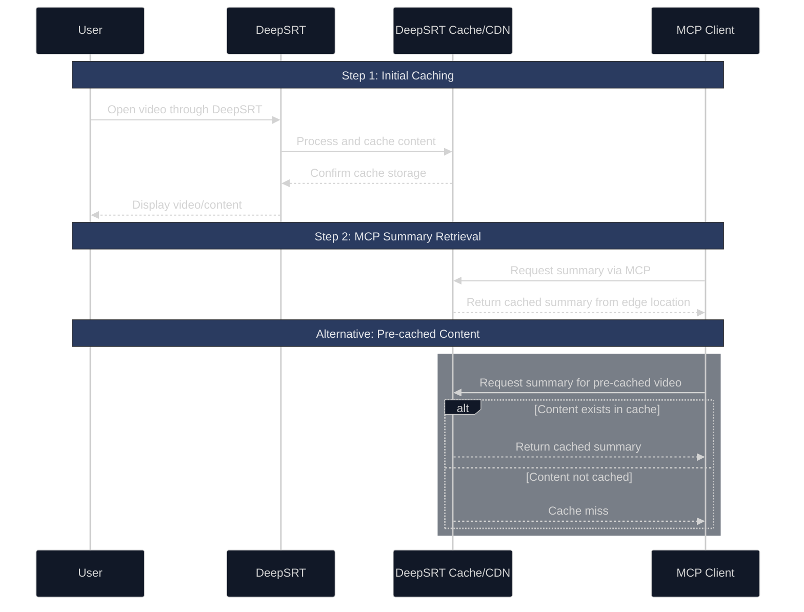

# deepsrt-mcp

`deepsrt-mcp` is a TypeScript-based MCP server that allows MCP clients to fetch YouTube summaries through DeepSRT service from edge locations.

## Features

The server provides a tool to generate summaries of YouTube videos in different languages and formats:

### Tools

- `get_summary` - Get summary for a YouTube video
  - **videoId** (required): YouTube video ID (e.g. "dQw4w9WgXcQ")
  - **lang** (optional): Language code for the summary. Default: "zh-tw"
  - **mode** (optional): Summary mode, either "narrative" or "bullet". Default: "narrative"

## How it Works

1. **Content Caching**
   - Videos must first be opened through DeepSRT to ensure content is cached in the service
   - This initial viewing triggers the caching process in the DeepSRT service

2. **MCP Summary Retrieval**
   - When requesting summaries through MCP, the content is served from DeepSRT's CDN edge locations
   - This ensures fast and efficient delivery of summaries

3. **Pre-cached Content**
   - Some videos may already be cached in the system from previous user requests
   - While you might be able to fetch summaries for these pre-cached videos, availability is not guaranteed
   - For best results, ensure videos are first opened through DeepSRT



## Installation

### Installing for Claude Desktop

1. First, build the server:
```bash
npm install
npm run build
```

2. Add the server configuration to your Claude Desktop config file:

- On macOS: `~/Library/Application Support/Claude/claude_desktop_config.json`
- On Windows: `%APPDATA%/Claude/claude_desktop_config.json`

```json
{
  "mcpServers": {
    "deepsrt-mcp": {
      "command": "node",
      "args": [
        "/path/to/deepsrt-mcp/build/index.js"
      ]
    }
  }
}
```

### Installing for Cline

Just ask Cline to install in the chat

>"Hey, install this MCP server for me from https://github.com/DeepSRT/deepsrt-mcp"

Cline will auto install `deepsrt-mcp` for you and update your `cline_mcp_settings.json`:

```json
{
  "mcpServers": {
    "deepsrt": {
      "command": "node",
      "args": [
        "/path/to/deepsrt-mcp/build/index.js"
      ],
      "disabled": false,
      "autoApprove": []
    }
  }
}
```

## Development

Install dependencies:
```bash
npm install
```

Build the server:
```bash
npm run build
```

For development with auto-rebuild:
```bash
npm run watch
```
